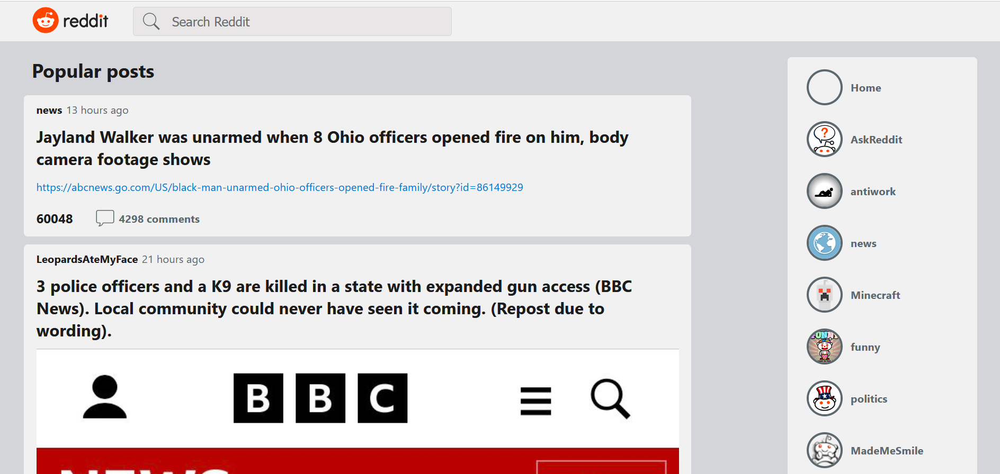
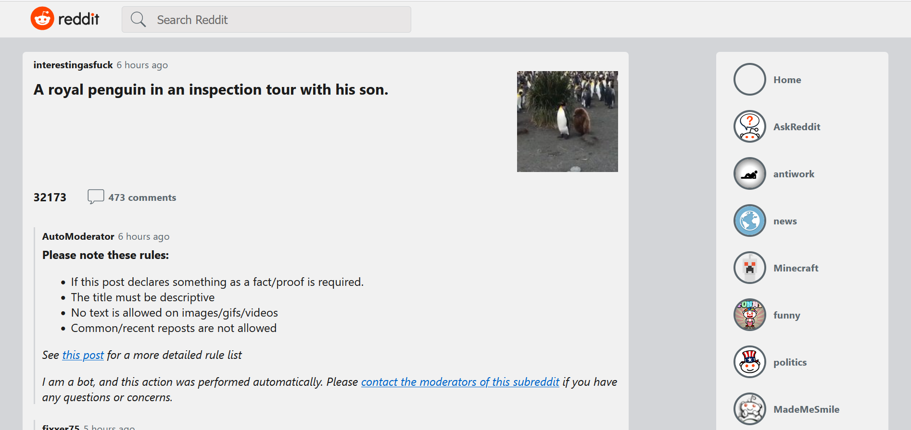
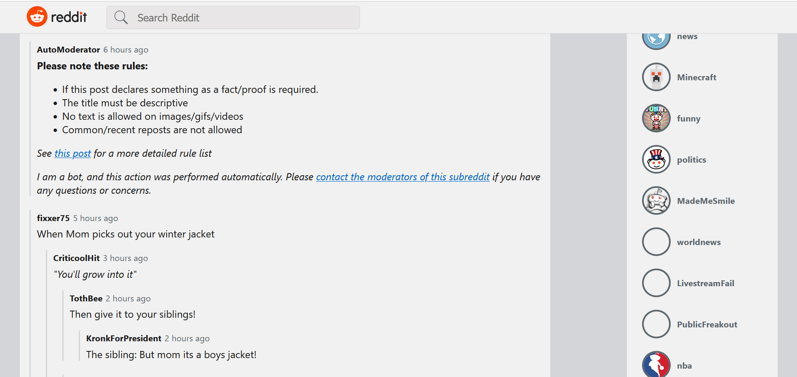

# Reddit client
This Angular web application uses the Reddit API to allow users to view and search posts and comments provided by the API.\
This project was built to practice working with **Angular** and **TypeScript**.\
This project was also built using **React** and **Redux** [here](https://github.com/makarovangelika/reddit-client).
## Usage
This project was generated with [Angular CLI](https://github.com/angular/angular-cli) version 14.2.1.
Run `ng serve` for a dev server. Navigate to `http://localhost:4200/`. The application will automatically reload if you change any of the source files.
## Features
The starting page shows the popular posts of Reddit. There are also the search bar at the top and the menu with popular subreddits on the right.

When the users click on the link of the subreddit in the post or in the menu they can see the list of subreddit's posts.\
When the users click on the post in the list they are navigated to the separate route for an individual post. On this page they can see the post and the comments which are displayed with nested replies.

When the users click on the icon with the number of comments in the list of the posts they are navigated to the section with the comments to the corresponding post.

## Technologies
During the development of this project these technologies were used:
* Angular 14.0.0
* ngx-markdown 14.0.1\
The library was used for converting some of the comments and posts in Markdown into html.
* Moment 2.29.4\
The library was used for displaying the relative time of the post's and the comment's creation.